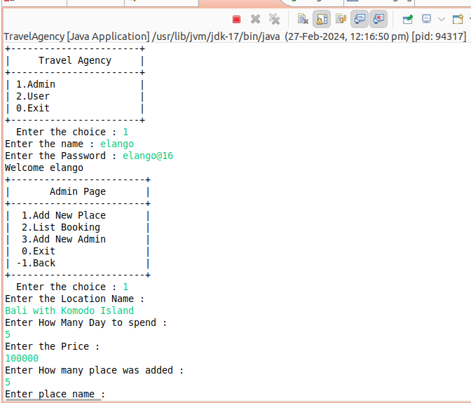

# Travel Agency System

This is a simple Travel Agency System that follows the MVVM (Model-View-ViewModel) pattern, managing administrators, locations, places, and user bookings.

## Table of Contents
- [Introduction](#introduction)
- [Features](#features)
- [Database Schema](#database-schema)
- [Project Structure](#project-structure)
- [Setup and Usage](#setup-and-usage)
- [Preview](#preview)


## Introduction

The Travel Agency System is designed with a focus on the MVVM pattern, providing a structured architecture for managing travel-related activities. The project includes views, view models, DTOs, and a repository to ensure separation of concerns and maintainability.

## Features

- **Admin Management:** Add new administrators to the system.
- **Location Management:** Add new locations with associated places and details.
- **Booking Management:** Allow users to book travel locations.

## Database Schema

The database schema consists of four tables:

1. `admins`: Stores information about administrators.
2. `location`: Stores details about travel locations.
3. `place`: Contains information about places associated with locations.
4. `booking`: Records user bookings.


```sql
create table admins(
	admin_id int primary key auto_increment,
	admin_name varchar(50),
    admin_password varchar(50)
);
```

```sql
create table location(
	l_id int primary key auto_increment,
    l_name varchar(100) not null,
    day int not null,
    price int not null
);
```

```sql
create table place(
	p_id int primary key auto_increment,
    l_id int ,
    p_name varchar(100) not null,
    p_about text not null,
    foreign key(l_id) references location(l_id)
);
```

```sql
create table booking(
	b_id int primary key auto_increment,
    user_name varchar(50),
    residence varchar(50),
    email varchar(50),
    vacation_type varchar(100),
    l_name varchar(100),
    day int,
    b_date date,
    no_of_people int,
    total_price int
);
```

Refer to the [Database Schema](#database-schema) section in the README for SQL statements to create these tables.

## Project Structure

- `travelagency.admin`: Contains classes related to the admin features.
- `travelagency.admin.view`: Handles user input/output for admin-related tasks.
- `travelagency.admin.viewmodel`: Manages the logic and communication between views and the repository for admin-related tasks.
- `travelagency.dto`: Defines Data Transfer Objects (DTOs) for the project entities.
- `travelagency.repository`: Provides database-related functionality and acts as a bridge between the application and the database.
- `travelagency.user`: Contains classes related to user features.
- `travelagency.user.view`: Handles user input/output for user-related tasks.
- `travelagency.user.viewmodel`: Manages the logic and communication between views and the repository for user-related tasks.

## Setup and Usage

To run the Travel Agency System:

1. Set up a MySQL database and execute the SQL statements from the [Database Schema](#database-schema) section to create the required tables.
2. Update the database connection details in the `GetConnection` class located in `travelagency.repository`.
3. Run the application, starting from the main class (`AdminMain` or `UserMain`) based on the desired role.


## Preview

---

---

---

---

---

---

---
